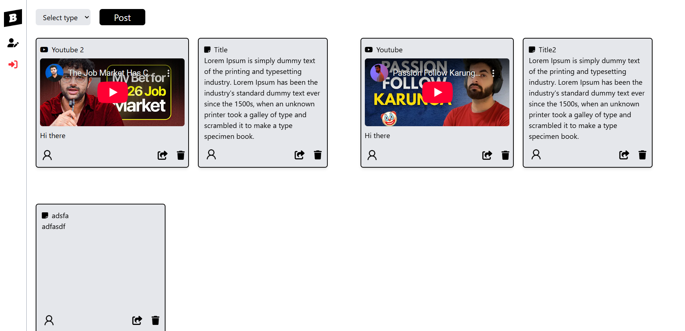
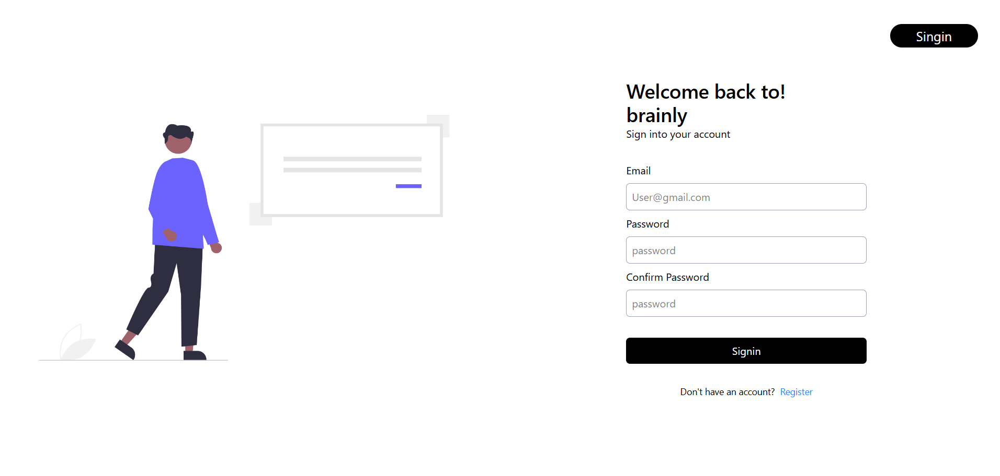
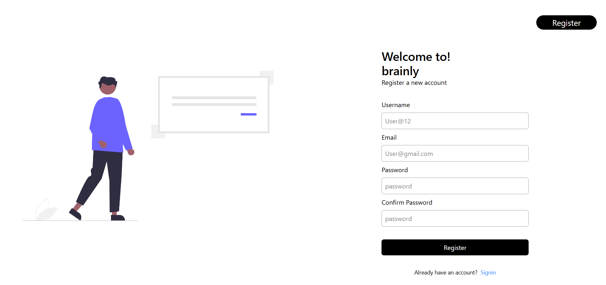
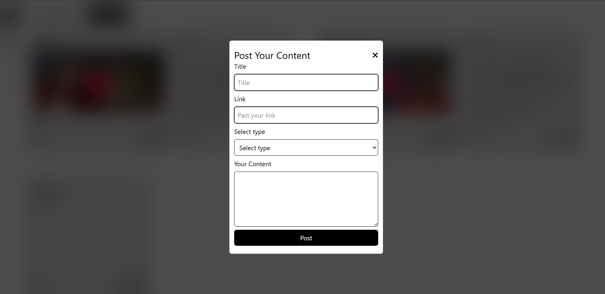
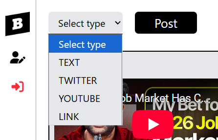

# BRAINLY 

## About the project

A full-stack BRAINLY  built with **Node.js**, **Express.js**, **Mongoose**, **React**, **Tailwind**and **JWT** .  
Users can save there daily basis links, posts, todo in the chat where they can access update and remove.

---

## 🌐 Live Demo
🔗 [View Live Project](https://brainly-0ui5.onrender.com)

---

## Installation 

To set up the Airbnb on your local machine, follow these steps:

1. **Clone the Repository**:
    ```
    git clone https://github.com/warsi0707/Brainly
    ```

2. **Install Dependecies**:
    ```bash
    npm install
    ```

3. **Run the Application**:
    ```
    node index.js
    ```

---

## Technologies Used

- **Frontend**:
  - React.js: For building the user interface.
  - React-Router: For navigation.
  - react-hot-toast: For pop-up status message.
  - Tailwind CSS: For styling components.


- **Backend**:
  - Node.js: For server-side logic.
  - Express.js: For building the RESTful API.

- **Database**:
  - Mongoose: For storing user and transaction data.

- **Authentication**:
  - JSON Web Tokens (JWT): For secure user authentication.

- **Others**:
  - Fetch: For making HTTP requests.
  - dotenv: For managing environment variables.
  - bcrypt: For password hashing.
  - cors: For connect backend and frontend


---

## Screenshots

### Homepage


### Loged in page 


### Signup page


### Filter page


### Signup page



